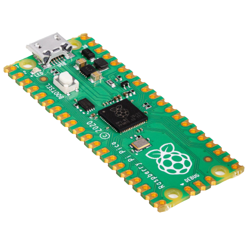

*********************************************
Laboratorio de Sistemas Embebidos de IMPA TRQ
*********************************************

Buscamos recopilar toda la informacion, ejemplos y guias que desarrollemos para que quienes nos visiten tengan una mejor experiencia trabajando con sistemas embebidos.

.. note::

   Este proyecto esta bajo constante desarrollo.

Nuestros microcontroladores
===========================

+-----------------------+
| |Raspberry Pi Pico|_  |
+=======================+
| `Raspberry Pi Pico`_  |
+-----------------------+

.. _Raspberry Pi Pico: ./raspberry-pi-pico/index.html