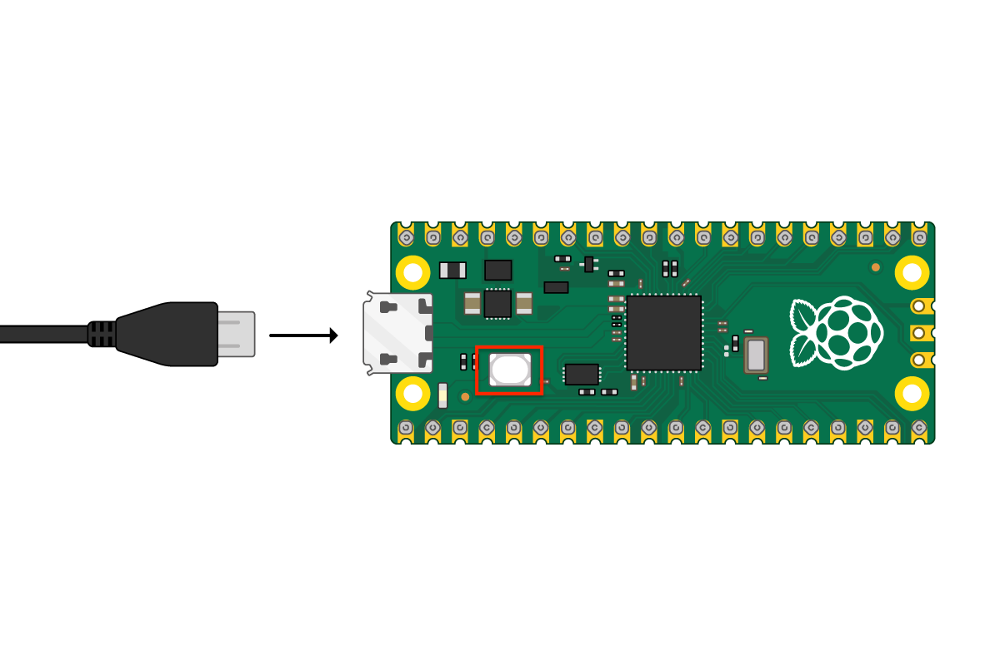

*********************************
Platformio para Raspberry Pi Pico
*********************************

PlatformIO es una extension muy popular de Visual Studio Code para programar una variedad de microcontroladores en el mismo IDE.

Esta guia ofrece instrucciones para hacer algunas modificaciones en PlatformIO para poder programar, flashear y debuggear la Raspberry Pi Pico con el SDK.

.. note::

    Es requisito para esta guia tener instalado Visual Studio Code con la extension PlatformIO y Cortex-Debug. Git es necesario para que PlatformIO funciones y pueda descargar paquetes.

En el Home de PlatformIO, vamos a buscar la opcion de Platforms, donde vamos a ver toda una lista de plataformas instaladas para poder programar. La Raspberry Pi Pico con el SDK para programarla en baremetal no es una opcion que venga por defecto por lo que debemos agregarla. Para eso, buscamos la opcion de Advanced Installation. En el nuevo menu que va a aparecer, pegamos el siguiente link y procedemos a instalarlo:

.. code::

    https://github.com/maxgerhardt/wizio-pico.git

Esto va a descargar las herramientas necesarias para poder trabajar con la Raspberry Pi Pico en baremetal, por lo que va a tomar unos momentos.

Proyecto nuevo
~~~~~~~~~~~~~~

Con la extension de PlatformIO, creamos un proyecto para la placa ``WizIO - Raspberry Pi Pico ( CMSIS-DAP )`` con el framework ``Baremetal`` que ofrece por defecto.

Revisemos la estructura tipica de un proyecto de PlatformIO. Esta va a verse algo asi:

.. code::

    ├── .gitignore
    ├── .pio
    │   └── build
    │       ├── pico-dap
    │       │   ├── .sconsign311.dblite
    │       │   ├── APPLICATION.bin
    │       │   ├── APPLICATION.elf
    │       │   ├── idedata.json
    │       │   ├── sdk
    │       │   │   ├── ...
    │       │   └── src
    │       │       └── ...
    │       └── project.checksum
    ├── .vscode
    │   ├── c_cpp_properties.json
    │   ├── extensions.json
    │   └── launch.json
    ├── include
    │   ├── README
    │   └── pico
    │       └── config_autogen.h
    ├── lib
    │   └── README
    ├── platformio.ini
    ├── src
    │   └── main.c
    └── test
        └── README

De esta estructura de directorios nos interesa:

- `platformio.ini`: tiene la configuracion basica del proyecto.
- `src/main.c`: es el lugar donde va nuestro programa principal.
- `include/`: aca podemos dejar archivos `.h` sueltos para incluirlos en nuestro programa principal.
- `lib/`: en este directorio, podemos incluir bibliotecas externas con su `.h` y `.c` para usarlas en el programa principal.
- `vscode/launch.json`: archivo con configuraciones para debuggear.
- `.pio/build/pico-dap/APPLICATION.elf`: binario que usamos para debuggear el programa.

Como agregar bibliotecas
~~~~~~~~~~~~~~~~~~~~~~~~

Supongamos que conseguimos una biblioteca para usar un LCD de 16x2 a traves del I2C de la Raspberry Pi Pico. Lo que vamos a hacer, es agregarla al directorio `lib` del proyecto.

Dentro de ese directorio vamos a crear un directorio y poner los archivos de la biblioteca de forma tal que quede:

.. code::

    ./lib/
    ├── README
    └── lcd
        ├── lcd.c
        └── lcd.h

De esta forma, ya tenemos nuestra biblioteca lista para usar e incluir en nuestro programa principal. Ahora podemos escribir en nuestro `main.c`:

.. code:: c

    #include "lcd.h"

    ...

Compilar y programar
~~~~~~~~~~~~~~~~~~~~

Para compilar el codigo, buscamos la opcion de *Build* dentro del menu de opciones del PlatformIO. Si no tenemos errores, podemos subir directamente el codigo manteniendo apretado el boton de BOOTSEL de la placa de desarrollo y conectando la Rasbperry Pi Pico por USB a la computadora.




Como debuggear
~~~~~~~~~~~~~~

En primer lugar, vamos a modificar el ``platformio.ini`` para que se vea asi:

.. code::

    [env:pico-dap]
    platform = wizio-pico
    board = pico-dap
    framework = baremetal
    build_type = debug

El unico cambio es el agregar instrucciones sobre el tipo de compilacion. Esto va a permitir que a la hora de debuggear, podamos ejecutar el programa instruccion por instruccion.

Por otro lado, tenemos que modificar el `launch.json` para agregar una configuracion de debuggeo con la extension Cortex-Debug y OpenOCD.

.. note::

    OpenOCD puede instalarse con ```sudo apt install openocd``` para sistemas operativos con distribuciones de Debian / Ubuntu y ```brew install openocd``` para MacOS.

    Para Windows se puede descargar un comprimido ya compilado desde este `link`_ con el cuidado de que debe ser agregado al path de Windows.

.. _`link`: https://gnutoolchains.com/arm-eabi/openocd/

El `launch.json` que vamos a modificar agregamos una configuracion adicional en el array de *configurations* para que se lance una instancia de debuggeo con el OpenOCD usando el binario *APPLICATION.elf*. Lo que agregamos es lo siguiente:

.. code:: json

    {
        "version": "0.2.0",
        "configurations": [
            {
                "cwd": "${workspaceRoot}",
                "executable": ".pio/build/pico-dap/APPLICATION.elf",
                "name": "Debug with OpenOCD",
                "request": "launch",
                "type": "cortex-debug",
                "servertype": "openocd",
                "configFiles": [
                    "interface/cmsis-dap.cfg",
                    "target/rp2040.cfg"
                ],
                "openOCDPreConfigLaunchCommands": [
                    "set USE_CORE 0"
                ],
                "openOCDLaunchCommands": [
                    "adapter speed 4000",
                ],
                "searchDir": [],
                "runToEntryPoint": "main",
                "showDevDebugOutput": "none",
                "svdFile": "${env:PICO_SDK_PATH}/src/rp2040/hardware_regs/rp2040.svd"
            },
            ...
        ]
    }

Como ultimo paso antes de debuggear, necesitamos cargarle un firmware a la Raspberry Pi Pico en la RAM para que pueda usar el segundo procesador como interfaz USB a CMSIS-DAP para debuggear el primer procesador. Para lograr eso, bajamos el firmware desde este repositorio_ en GitHub y lo grabamos como se explico en el paso anterior.

.. _repositorio: https://github.com/majbthrd/pico-debug/releases/download/v10.05/pico-debug-gimmecache.uf2

Por ultimo, una vez flasheado el firmware, podemos proceder a compilar el proyecto, ir a la interfaz de Visual Studio Code de *Run and Debug*, seleccionamos la configuracion que acabamos de crear que se va a llamar *Debug with OpenOCD* y la corremos.