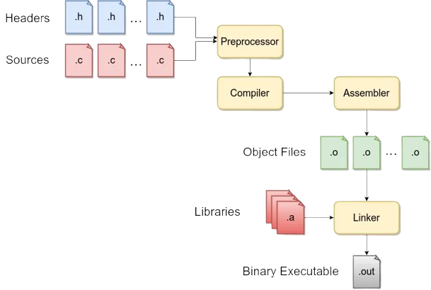
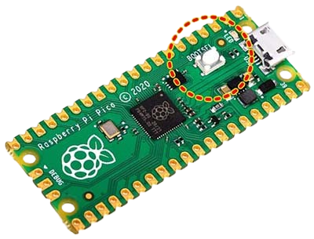

*****************
Compilar y grabar
*****************

Una vez que tengamos un proyecto de ejemplo listo, vamos a proceder a ver cómo podemos compilar el programa y grabar el programa en la flash del microcontrolador para que comience a correr.

Compilación
***********

El proceso de compilación implica una serie de programas que toman nuestros distintos archivos escritos en lenguaje C, resuelven las dependencias entre ellos, lo pasan a un programa equivalente en Assembly acorde a la arquitectura del procesador y finalmente tiene como salida un único archivo binario que vamos a poder grabar en la flash del microcontrolador.

Afortunadamente, el proceso entero de compilación está bastante simplificado en la extensión. Podemos acceder a este desde el menú de la extensión que vamos a encontrar en la barra lateral con el nombre *Compile Project* y desde la barra inferior en la derecha, vamos a encontrar el comando bajo el nombre de *Compile*.

Grabar programa
***************

Para poder grabar o flashear el proyecto, tenemos que tener acceso a la flash de la Raspberry Pi Pico. Para poder hacerlo, tenemos que alimentar al microcontrolador con el micro USB manteniendo apretado el botón de BOOTSEL que hay en la placa.

Una vez que hacemos esto, la Raspberry Pi Pico va a aparecer como un dispositivo de almacenamiento en la computadora. Si esto sucede, podemos proceder a flashear la aplicación en la memoria desde el menú de la extensión en la barra de la izquierda bajo el comando con la opción *Run Project (USB)* o en la barra inferior del lado derecho en la opción con el nombre *Run*.

Si no hay errores en la terminal, el programa va a estar corriendo en el microcontrolador con normalidad.